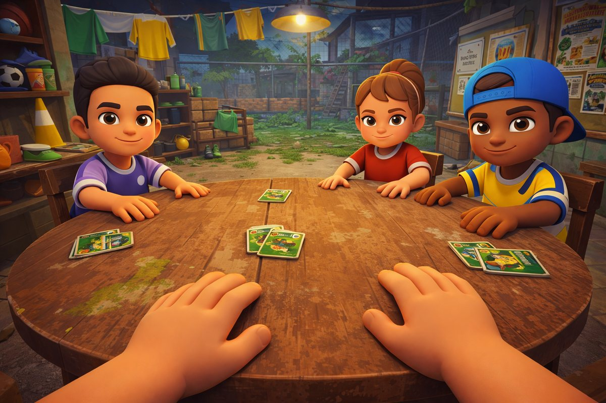
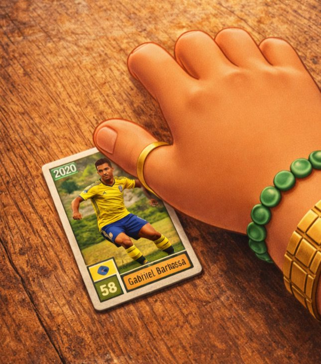
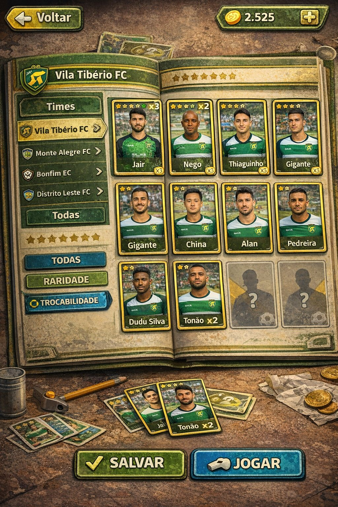
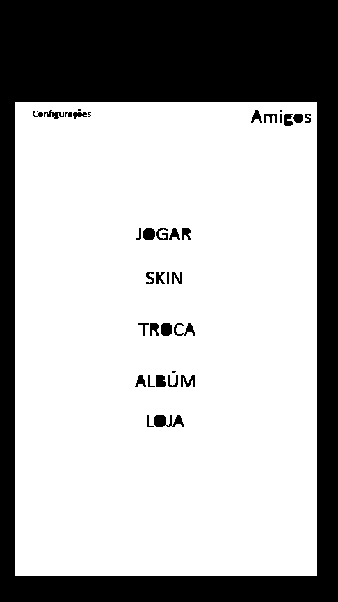
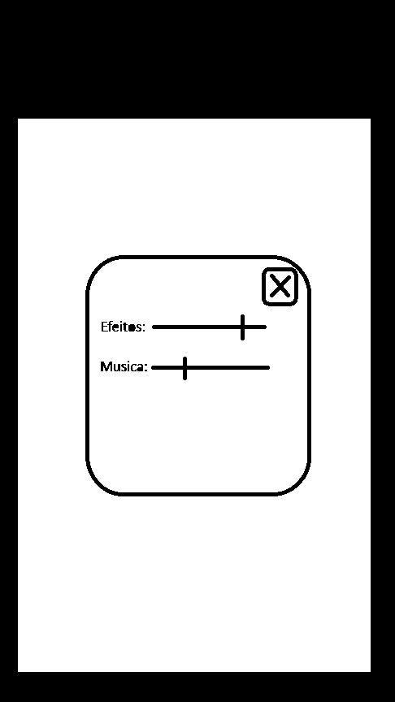
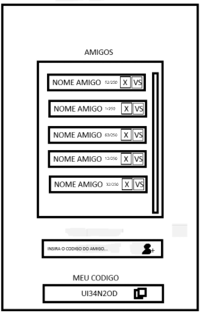
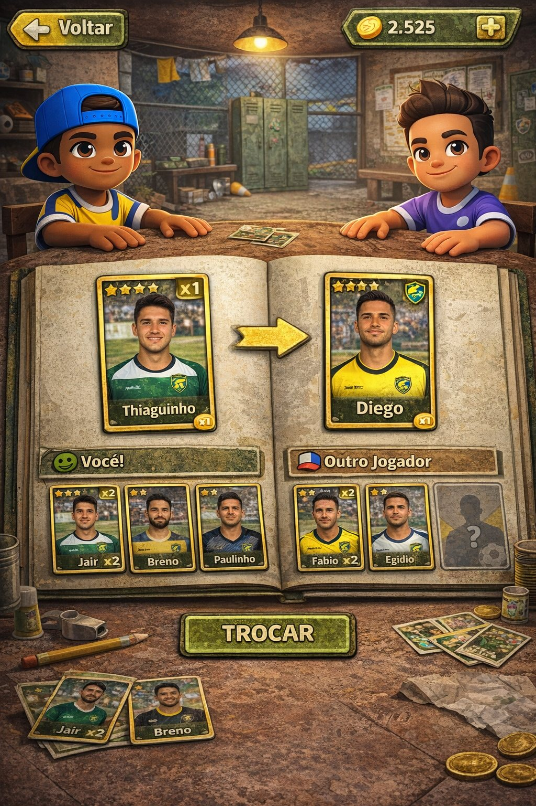
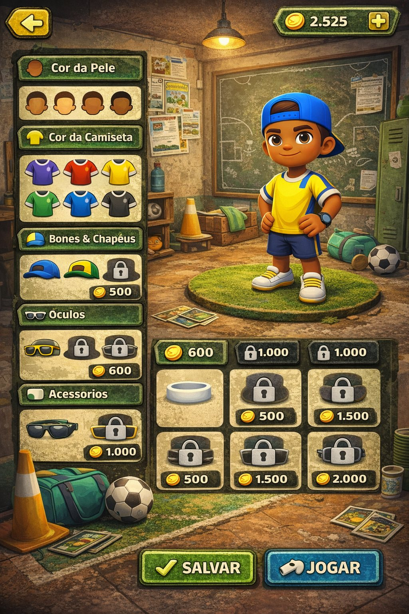
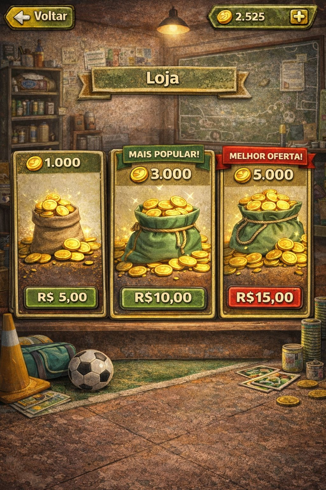
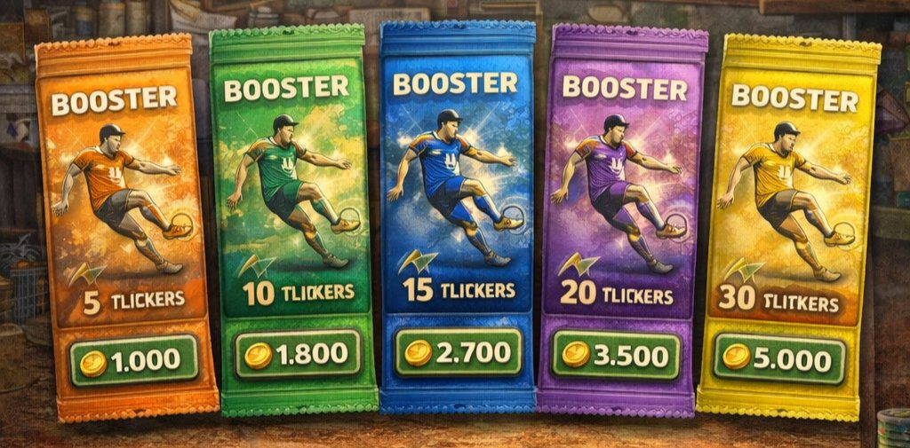

# VARZEA BAFÃO

**Documento de produção · versão 1 · 16 de setembro de 2026**

Jogo mobile de **figurinhas de futebol de várzea** com partidas de **bafo** online. Este documento é o plano completo de desenvolvimento: o que é o jogo, como cada tela funciona, quem faz cada parte e em que semana.

| Plataforma | Engine | Equipe | Prazo |
|---|---|---|---|
| Android → iOS | Unity 6 LTS | 3 pessoas | 12 semanas |

---

## Índice

- [00 · Como usar este documento](#00--como-usar-este-documento)
- [01 · O que é o jogo](#01--o-que-é-o-jogo)
- [02 · A equipe e quem faz o quê](#02--a-equipe-e-quem-faz-o-quê)
- [03 · Direção de arte](#03--direção-de-arte)
- [04 · Mapa de telas](#04--mapa-de-telas)
- [05 · Telas, uma a uma](#05--telas-uma-a-uma)
- [06 · Modularidade e conteúdo](#06--modularidade-e-conteúdo)
- [07 · Sistema de figurinhas](#07--sistema-de-figurinhas)
- [08 · A partida de bafo](#08--a-partida-de-bafo)
- [09 · Economia](#09--economia)
- [10 · Arquitetura técnica](#10--arquitetura-técnica)
- [11 · Cronograma](#11--cronograma--12-semanas)
- [12 · Padrões de trabalho](#12--padrões-de-trabalho)
- [13 · Decisões pendentes](#13--decisões-pendentes)
- [14 · Versão Roblox](#14--versão-roblox)
- [15 · Glossário](#15--glossário)

---

## 00 · Como usar este documento

Leia inteiro uma vez.

O documento tem duas metades. Da seção 01 à 10 está **o que o jogo é** — a regra, a tela, o número, a arquitetura. Essa parte é a fonte da verdade: se o jogo na tela não bate com o que está escrito aqui, ou o jogo está errado ou o documento precisa ser corrigido; nunca os dois em silêncio. Da 11 à 15 está **como vamos construir** — o cronograma semana a semana, os padrões de arquivo e as decisões que ainda faltam.

Cada tarefa do cronograma tem o nome de quem faz.

> **Regra de ouro** — Se algo aqui estiver ambíguo, não invente e não trave: escreva a dúvida no grupo, proponha uma resposta e siga com a proposta. Uma decisão registrada e revisável vale mais que uma semana parada esperando confirmação.

---

## 01 · O que é o jogo

Varzea Bafão é um álbum de figurinhas vivo. O jogador coleciona craques de times de várzea, completa o álbum e arrisca as figurinhas repetidas numa partida de bafo contra outros jogadores.

A fantasia é dupla e as duas metades precisam aparecer na tela: a **nostalgia do bafo de escola** — a mesa de madeira, o monte de figurinhas, a mão batendo — e a **várzea de verdade** — campo de terra, alambrado, varal de camisa, vestiário de tijolo aparente. O jogador não é um gerente de time nem um jogador de futebol. Ele é o moleque que colecionava e apostava figurinha no intervalo.

### O loop principal

Todo o jogo gira nestes seis passos. Toda decisão de design deve reforçar esse ciclo, não abrir outro.

1. **Abre booster** — recebe figurinhas novas e repetidas
2. **Cola no álbum** — vê o que falta para fechar o time
3. **Joga bafo** — aposta repetidas contra outros jogadores
4. **Ganha figurinhas e moedas** — leva o que virou na mesa
5. **Troca com amigos** — resolve o que o bafo não deu
6. **Compra mais booster** — e o ciclo recomeça

### Para quem é

| Item | Definição |
|---|---|
| Público | Quem joga, assiste ou vive futebol de várzea no Brasil. De 14 a 40 anos, núcleo entre 18 e 30 |
| Aparelho alvo | Android intermediário, 4 GB de RAM, tela 1080×2400. É nele que o jogo tem que rodar a 60 fps — não no celular mais caro da equipe |
| Sessão típica | 5 a 8 minutos: abre o jogo, cumpre uma missão, joga 2 ou 3 partidas, confere o álbum |
| Conexão | 4G instável. O jogo precisa sobreviver a queda de sinal no meio da partida |
| Idioma | Português do Brasil, com gíria de várzea. Sem tradução no primeiro ciclo |

### O que este jogo não é

- **Não é um jogo de futebol.** Ninguém controla jogador em campo. A bola só aparece como cenário e na arte das figurinhas.
- **Não é card battler de atributos.** A nota da figurinha (o `58` da arte) é valor de coleção e critério de troca, não poder de combate.
- **Não é pay-to-win.** Não existe vantagem de partida comprada com dinheiro — quem paga acelera a coleção, não ganha a mesa.

---

## 02 · A equipe e quem faz o quê

Três pessoas, três territórios que não se sobrepõem. Cada arquivo do projeto tem um dono claro.

### 🔴 Gabriel — Interface e arte 2D

Dono de **tudo que é plano e clicável**: todas as telas de menu, HUD, botões, ícones, a arte das figurinhas, as embalagens de booster, o álbum, a loja, as telas de troca e resultado. Também é dono do guia de estilo — paleta, tipografia, tamanhos e espaçamentos — e de dizer se uma tela está ou não dentro da identidade.

**Entrega:** arquivos-fonte editáveis mais PNG exportado no padrão da seção 12, prontos para o Guilherme montar na Unity.

### 🔵 Lucas — 3D, cena e animação

Dono de **tudo que tem volume e se move no mundo**: personagens e suas skins, o vestiário, a mesa de bafo, a mão do jogador, a iluminação, a câmera e todas as animações — bater na mesa, comemorar, lamentar, entrar e sair da mesa. Também é dono do orçamento de polígonos e de garantir que a cena roda no aparelho alvo.

**Entrega:** `.fbx` no padrão da seção 12 mais a cena montada e iluminada dentro da Unity.

### 🟣 Guilherme — Código, sistemas e servidor

Dono de **tudo que decide e persiste**: o cliente Unity em C#, a navegação entre telas, as regras da partida, a economia, o servidor, o banco de dados, o matchmaking, o anti-trapaça e a geração de builds. É quem monta na Unity a arte que Gabriel e Lucas entregam e quem dá a palavra final sobre performance.

**Entrega:** build instalável no celular, ao fim de cada fase, com o que aquela fase prometeu.

### ⚪ Rodrigo — Produto e aprovação

Decide escopo, aprova arte e fecha as pendências da seção 13. É quem responde quando uma decisão não está neste documento.

### Fronteiras que costumam gerar briga

| Situação | Dono | Por quê |
|---|---|---|
| Arte de um botão | Gabriel | É 2D de interface |
| Botão animar ao ser tocado | Guilherme | Animação de UI é código; Gabriel define como deve parecer |
| Boneco na tela de Skin | Lucas | É modelo 3D, mesmo aparecendo dentro de um menu |
| Molduras e preços em volta do boneco | Gabriel | É a interface por cima do 3D |
| Carta virando na mesa | Lucas | Animação no mundo 3D |
| Quais cartas viram | Guilherme | É regra, e regra vive no servidor |
| Arte da figurinha | Gabriel | É 2D, mesmo sendo aplicada num objeto 3D |

---

## 03 · Direção de arte

A referência abaixo é o alvo. Quando houver dúvida sobre como algo deve parecer, a resposta está nestas imagens.



*Referência mestra da partida. Câmera em primeira pessoa, as mãos do jogador na borda da mesa, os adversários do outro lado.*

**O que essa imagem define:**

- **Personagens em cartoon 3D** — proporção infantil, cabeça grande, mãos grandes, traços limpos e olhos expressivos. Nada realista.
- **Cenário sujo e real** — tijolo, alambrado, varal de camisa, cone, lâmpada pendurada. Tudo com desgaste e manchas.
- **Luz quente de lâmpada**, entardecer ou noite, com o fundo mais frio e escuro para destacar a mesa.
- **Enquadramento** — a mesa ocupa a metade de baixo da tela, os adversários a metade de cima.

### A figurinha



A carta é o objeto mais importante do jogo — o jogador vai olhar para ela milhares de vezes. Ela é **uma figurinha de papel**, não uma carta de RPG: papel fosco, borda branca desgastada, cantos levemente gastos, impressão com pequena falha de registro.

**Anatomia fixa:** ano da temporada no canto superior esquerdo · foto do jogador em ação com fundo de campo · faixa inferior com escudo do time, nota e nome · estrelas de raridade e contador de repetidas quando aplicável.

### A interface



Toda a interface é **diegética** — ela finge ser um objeto de verdade dentro do vestiário. O álbum é um livro gasto. A loja é uma prateleira de bar. Nada de painel translúcido flutuando no vazio.

**Regras não negociáveis:**

- **Nada limpo demais.** Toda superfície tem textura de papel, madeira, lona ou terra.
- **Verde desbotado + dourado** como base, com o vermelho reservado para alerta e oferta.
- **Sem gradiente de tela cheia** e sem glow neon. O brilho vem de lâmpada e de moeda, não de LED.
- **Texto sempre em placa** — faixa, fita ou etiqueta de madeira. Nunca solto sobre a textura.

> ⚠️ **Atenção na referência** — As imagens de referência foram geradas por IA e têm **texto corrompido** em vários pontos; o mais visível é `TLICKERS` na arte dos boosters, que deveria ser `FIGURINHAS`. Nenhum texto das referências deve ser copiado. Gabriel redesenha todo texto do zero.

---

## 04 · Mapa de telas

Nove telas no total. Toda tela volta para o Menu Principal — não existe caminho sem saída.

```
MENU PRINCIPAL
 ├─ JOGAR          → Fila de matchmaking → Mesa de bafo → Resultado
 ├─ SKIN           → personaliza o boneco → Salvar
 ├─ TROCA          → escolhe amigo → propõe → aguarda aceite
 ├─ ÁLBUM          → times → figurinha → detalhe
 ├─ LOJA           → moedas (dinheiro real) · boosters (moedas)
 ├─ AMIGOS         → adicionar por código · desafiar VS
 └─ CONFIGURAÇÕES  → volume
```

> **Regra de navegação** — O botão **Voltar** fica sempre no canto superior esquerdo. O **saldo de moedas** fica sempre no canto superior direito, com um `+` que leva direto à Loja. Esses dois elementos são os mesmos objetos em todas as telas: Gabriel entrega uma vez, Guilherme reaproveita.

---

## 05 · Telas, uma a uma

### Menu Principal



**Gabriel · Lucas · Guilherme**

Primeira tela depois da abertura. O fundo é o **vestiário em 3D com câmera parada** e leve movimento de respiração, não uma imagem chapada.

**Elementos**

- Engrenagem de Configurações, canto superior esquerdo
- Botão Amigos, canto superior direito, com selo de quantidade quando houver convite ou desafio pendente
- Cinco botões empilhados no centro: **JOGAR · SKIN · TROCA · ÁLBUM · LOJA**
- JOGAR é visualmente maior e mais destacado que os outros quatro
- Saldo de moedas com `+`, canto superior direito abaixo de Amigos

**Divisão**

- **Gabriel** — arte dos botões, ícones, selo de notificação, barra de moedas
- **Lucas** — cena do vestiário ao fundo, iluminação, movimento sutil de câmera
- **Guilherme** — navegação, carregamento do perfil, selo de pendências

---

### Configurações



**Gabriel · Guilherme**

Painel sobreposto ao menu, com o fundo escurecido. Não é uma tela cheia.

**Elementos**

- Controle deslizante **Efeitos** e **Música**, de 0 a 100
- Botão X para fechar, canto superior direito do painel
- Rodapé com apelido do jogador, ID da conta, versão do app, **Política de Privacidade** e **Termos de Uso**

> ⚠️ **Obrigatório** — Os links de privacidade e termos não estão no rascunho, mas são **exigência legal** porque o jogo coleta dados e vende itens. Precisam existir antes da primeira build pública.

**Divisão**

- **Gabriel** — painel, controles deslizantes, botão X, rodapé legal
- **Guilherme** — salvar volume no aparelho, aplicar nos dois canais de áudio, links abrindo no navegador

---

### Amigos



**Gabriel · Guilherme**

Amizade é por **código**, não por busca de nome. Isso evita assédio e simplifica muito o servidor.

**Elementos**

- Lista rolável de amigos. Cada linha: apelido, progresso do álbum (`52/250`), botão **X** para remover e botão **VS** para desafiar
- Campo *Insira o código do amigo…* com botão de adicionar
- Bloco **Meu código** com o código do jogador e botão de copiar

**Comportamento**

- Código com 8 caracteres maiúsculos, sem `O`, `0`, `I` e `1` para não confundir na hora de digitar
- Remover amigo pede confirmação
- **VS** envia um desafio que expira em 2 minutos; se o amigo estiver offline, mostra aviso e não envia
- Limite de 100 amigos

**Divisão**

- **Gabriel** — lista, linha de amigo, campo de código, bloco do código próprio, estado de lista vazia
- **Guilherme** — geração do código, adicionar, remover, presença online, desafio VS

---

### Álbum


**Gabriel · Guilherme**

O coração da coleção. É um livro aberto, com aba de times à esquerda e a grade de figurinhas à direita.

**Elementos**

- Abas de time: **Vila Tibério FC · Monte Alegre FC · Bonfim EC · Distrito Leste FC · Todas**
- Barra de estrelas no topo mostrando o quanto falta para completar o time selecionado
- Filtros: **Todas · Raridade · Trocabilidade**
- Figurinha obtida mostra foto, nome, estrelas e `xN` quando repetida
- Figurinha não obtida mostra **silhueta com ponto de interrogação** — nunca revela quem é
- Rodapé com **Salvar** e **Jogar**

**Comportamento**

- Tocar numa figurinha abre o detalhe em tela cheia, com a arte grande e a opção de marcar como disponível para troca
- O filtro **Trocabilidade** mostra só as repetidas — é o atalho para quem vai negociar
- Completar um time inteiro dispara uma celebração e dá recompensa em moedas

**Divisão**

- **Gabriel** — livro, abas, grade, estados da figurinha, silhueta, detalhe em tela cheia, celebração de time completo
- **Guilherme** — carregar coleção do servidor, filtros, contagem de progresso, marcação de troca, recompensa de time completo

---

### Troca



**Gabriel · Lucas · Guilherme**

Troca é sempre **entre amigos** e sempre **1 figurinha por 1 figurinha** no primeiro ciclo. Simples assim — troca de vários por vários abre espaço para golpe e para inflação, e fica para depois.

**Elementos**

- Dois personagens frente a frente com as skins reais dos dois jogadores
- Livro aberto: à esquerda **Você**, à direita **Outro jogador**
- Carta grande em destaque de cada lado, com a seta de troca no meio
- Fileira de repetidas disponíveis embaixo de cada lado
- Botão **TROCAR**

**Comportamento**

- Só aparecem figurinhas **repetidas**. Figurinha única nunca entra em troca — o jogador não consegue esvaziar o próprio álbum por engano
- Os dois lados precisam confirmar. Se um sair, a proposta cai
- Depois de confirmada, a troca é definitiva e o jogador é avisado disso antes
- Limite de 10 trocas por dia por jogador, contra uso da troca para lavar conta

**Divisão**

- **Gabriel** — livro, cartas em destaque, fileiras, seta, botão, tela de confirmação
- **Lucas** — os dois personagens no vestiário com as skins corretas e reação ao fechar a troca
- **Guilherme** — proposta, aceite dos dois lados, transação atômica no banco, limite diário

---

### Skin



**Lucas · Gabriel · Guilherme**

Personalização do boneco que aparece na mesa de bafo e na troca. É o que dá identidade ao jogador na partida.

| Categoria | Grátis | Pagas | Observação |
|---|---:|---:|---|
| Cor da pele | 4 | 0 | Sempre grátis, sem exceção |
| Cor da camiseta | 6 | 0 | Grátis — é como o jogador se identifica na mesa |
| Bonés e chapéus | 2 | 6 | 500 a 1.500 moedas |
| Óculos | 1 | 5 | 600 a 2.000 moedas |
| Acessórios | 1 | 5 | Pulseira, relógio, corrente — 500 a 2.000 moedas |

**Comportamento**

- O boneco atualiza **ao vivo** quando o jogador toca numa opção, antes de comprar ou salvar
- Item bloqueado mostra cadeado e preço; tocar abre a confirmação de compra
- Se faltar moeda, o botão leva para a Loja e volta para a Skin depois
- **Salvar** grava; **Jogar** grava e já entra na fila

**Divisão**

- **Lucas** — boneco base, todos os itens modelados e encaixados, pódio de grama, troca de item em tempo real
- **Gabriel** — painéis de categoria, miniaturas dos itens, cadeado, etiqueta de preço, confirmação de compra
- **Guilherme** — catálogo, posse dos itens, compra validada no servidor, salvar a aparência no perfil

---

### Loja



**Gabriel · Guilherme**

A Loja tem **duas abas**. A referência mostra só a primeira.

**Aba 1 — Moedas (dinheiro real)**

| Moedas | Preço | Selo | Moeda por real |
|---:|---:|---|---:|
| 1.000 | R$ 5,00 | — | 200 |
| 3.000 | R$ 10,00 | Mais popular | 300 |
| 5.000 | R$ 15,00 | Melhor oferta | 333 |

**Aba 2 — Boosters (moedas)** — mesma tabela da seção 09.

**Comportamento**

- Compra de moeda passa pela cobrança da loja do sistema (Google Play), **nunca por cobrança própria**
- O servidor valida o recibo antes de creditar. Cliente nunca credita moeda
- Compra de booster com moeda é instantânea e já abre a animação de abertura
- Se o app fechar no meio da compra, o crédito é recuperado na volta

**Divisão**

- **Gabriel** — prateleira, cartões de pacote, sacos de moeda, selos de oferta, abas
- **Guilherme** — Google Play Billing, validação de recibo no servidor, crédito, recuperação de compra interrompida

---

### Booster e abertura



*O texto da referência está corrompido e será redesenhado.*

**Gabriel · Guilherme**

A abertura do booster é **o momento mais importante do jogo**. É o que faz o jogador voltar amanhã. Merece mais capricho que qualquer outra animação.

**Sequência da abertura**

1. A embalagem entra na tela e fica no centro
2. O jogador **arrasta o dedo** para rasgar o pacote — o rasgo acompanha o dedo
3. As figurinhas saem em leque, viradas para baixo
4. O jogador toca em cada uma para virar, uma por vez
5. Figurinha nova ganha selo **NOVA**; repetida mostra `+1` e quanto vale em moeda
6. Figurinha de 4 ou 5 estrelas tem tratamento especial: a tela escurece, a carta brilha e o som muda
7. Tela final com o resumo e os botões **Ver no álbum** e **Abrir outro**

> **Regra de servidor** — O conteúdo do booster é sorteado **no servidor, antes da animação começar**, e enviado pronto ao cliente. A animação só revela o que já foi decidido. Isso impede que o jogador feche o app para tentar um sorteio melhor.

**Divisão**

- **Gabriel** — cinco embalagens (texto redesenhado), efeito de rasgo, leque, selo NOVA, tratamento de raridade alta, tela de resumo
- **Guilherme** — sorteio no servidor, tabela de raridade, garantia de raridade, gesto de rasgar, virar carta, gravar no álbum

---

### Mesa de bafo


**Lucas · Guilherme · Gabriel**

A tela da partida. As regras completas estão na seção 08.

**Elementos**

- Mesa redonda de madeira, câmera em primeira pessoa, mãos do jogador na borda de baixo
- Até três adversários do outro lado, cada um com sua skin
- Monte central com as figurinhas apostadas
- HUD: de quem é a vez, quantas figurinhas restam no monte, o que cada um já ganhou, tempo do turno

**Divisão**

- **Lucas** — mesa, vestiário, mãos, três adversários, animação de batida com variações, reação de comemorar e lamentar, carta virando, câmera
- **Gabriel** — HUD de turno, indicador de monte, medidor de força, tela de aposta, tela de resultado
- **Guilherme** — fila, servidor de partida, regra da batida, bots, reconexão, distribuição do prêmio

---

## 06 · Modularidade e conteúdo

O jogo é um motor vazio. Time, página de álbum e figurinha são conteúdo que entra e sai por planilha, nunca por código. E a arte real das figurinhas é **a última coisa a entrar no projeto** — o desenvolvimento inteiro roda com figurinhas provisórias.

> **A regra que governa todo o resto** — Nenhum nome de time, ID de figurinha ou quantidade de páginas aparece em código C#, em cena da Unity ou em nome de arquivo de arte. **Se para adicionar um time alguém precisar abrir a Unity, a arquitetura está errada** — e a correção é imediata, não depois.

### O que é conteúdo e o que é código

| Coisa | É | Muda por planilha? | Exige build nova? |
|---|---|---|---|
| Coleção / temporada | Conteúdo | Sim | Não, a partir do nível 2 |
| Página do álbum / time | Conteúdo | Sim | Não, a partir do nível 2 |
| Figurinha | Conteúdo | Sim | Não, a partir do nível 2 |
| Missão semanal | Conteúdo | Sim | Não |
| Pacote e preço da loja | Conteúdo | Sim | Não |
| Chance de raridade | Conteúdo | Sim | Não |
| Item de skin | Conteúdo | Sim | **Sim** — o modelo 3D viaja dentro do app |
| Regras do bafo | Código | Não | Sim |
| Fórmula da economia | Código | Não | Sim |
| Telas e navegação | Código | Não | Sim |

> ⚠️ **O outro extremo também é erro** — Modular não é configurável em tudo. **Não construir um motor de regras genérico** onde a mecânica do bafo vira parâmetro. Isso dobra o prazo, ninguém usa, e depois ninguém entende. Conteúdo vira dado; regra continua sendo código que se lê e se altera.

### Como o conteúdo é organizado

```
Coleção "Várzea 2026"
 └─ Página "Vila Tibério FC"   (ordem 1)
     └─ Figurinha VTB-014       (posição 14)
```

- **Coleção** — o álbum de uma temporada inteira. Amanhã pode existir uma "Várzea 2027" sem encostar na de 2026.
- **Página** — uma aba do álbum. Normalmente é um time, mas nada impede que seja "Craques", "Escudos" ou "Especiais". O jogo não sabe a diferença.
- **Figurinha** — ocupa uma posição numa página.

Os três níveis têm exatamente os mesmos campos de controle: `id`, `nome`, `ordem`, `ativo`, `entra_em`, `sai_em`. É o mesmo tratamento para os três, então quem aprende a mexer num, mexe nos outros.

### As cinco regras de ouro do catálogo

1. **ID nunca é reaproveitado.** Um `VTB-014` aposentado jamais vira outra figurinha. Reaproveitar ID transforma o álbum de quem já jogava em outro álbum, sem aviso.
2. **Nada é apagado, só desativado.** Remover um time é marcar `ativo = false`. Ele some da vitrine e dos sorteios, mas continua na coleção de quem já tinha aquelas figurinhas. Apagar linha do banco é a maneira mais rápida de quebrar o jogo de um jogador antigo.
3. **A tela se desenha a partir do catálogo.** A grade do álbum é gerada por laço, a partir dos dados. Nenhuma posição é montada à mão na cena da Unity.
4. **Arte é carregada por endereço**, nunca arrastada para dentro da cena. Na prática: *Addressables* da Unity desde a semana 1.
5. **`if (time == "Vila Tibério")` é proibido** em qualquer lugar do projeto. Se aparecer numa revisão, volta.

### Dois níveis de modularidade

| Nível | O que permite | Quando |
|---|---|---|
| **1 — obrigatório** | Mudar conteúdo sem tocar em código nem em cena. Ainda precisa de build nova, porque a arte viaja empacotada dentro do app | Fase 1 |
| **2 — meta** | Conteúdo e arte baixados do servidor. Um time novo entra no ar **sem passar pela loja de aplicativos** e sem o jogador atualizar nada | Fase 4, se o nível 1 estiver sólido |

Usar Addressables desde o primeiro dia é o que torna o salto do nível 1 para o nível 2 quase de graça. Começar com referência direta na cena e migrar depois custa semanas.

> **O teste de fogo — semana 9** — O Guilherme adiciona **um quinto time inteiro, com 20 figurinhas**, mexendo só na planilha de conteúdo. Se precisar abrir a Unity ou escrever uma linha de C#, a modularidade falhou e se conserta naquela semana, enquanto ainda é barato. Isso está no cronograma como tarefa obrigatória, não como sugestão.

### Figurinhas provisórias

A arte real das figurinhas é a **última coisa** a entrar no projeto. Durante as 12 semanas o jogo roda inteiro com figurinhas provisórias. Isso é decisão, não atraso.

1. **Gabriel** entrega **um modelo** de figurinha — a moldura, a faixa, as estrelas, as cinco variações de raridade. Um arquivo, não duzentos e cinquenta.
2. **Guilherme** escreve um gerador que lê a planilha de conteúdo e cospe as 250 imagens provisórias: cor sólida do time, número grande, silhueta genérica, nome `JOGADOR 014`.
3. Tudo é testado com essas: álbum, booster, troca, bafo, contagem de progresso, celebração de time completo.
4. Quando a arte real chegar, **troca-se o arquivo de imagem**. O ID, a posição, a raridade e o resto continuam idênticos.

> **Por que isso muda o projeto inteiro** — Produzir 250 artes é o trabalho mais longo do projeto e o único que depende da definição de quem são os jogadores. Separando as duas coisas, **nem o jogo espera a arte, nem a arte espera o jogo** — e essa definição deixa de ser um bloqueio da semana 4 para virar um bloqueio da fase de conteúdo, lá na frente.

---

## 07 · Sistema de figurinhas

O álbum tem 250 figurinhas. Esse número está no rascunho da tela de Amigos e é a base de todo o balanceamento — mas é um número de planilha, não uma constante no código.

### Estrutura da coleção

| Camada | Quantidade | Detalhe |
|---|---:|---|
| Figurinhas no álbum | 250 | Total do primeiro ciclo |
| Times | 4 | Vila Tibério FC, Monte Alegre FC, Bonfim EC, Distrito Leste FC |
| Jogadores por time | 60 | 240 no total |
| Figurinhas especiais | 10 | Escudos e fotos de time, fora das abas de jogador |

### Raridade e sorteio

Cinco níveis, marcados em estrelas na carta. A distribuição abaixo é o **ponto de partida** — vai mudar depois do primeiro teste com jogadores.

| Raridade | No álbum | Chance por figurinha | Vale em moeda (repetida) |
|---|---:|---:|---:|
| ★ Comum | 120 | 60 % | 5 |
| ★★ Incomum | 70 | 25 % | 15 |
| ★★★ Rara | 40 | 10 % | 50 |
| ★★★★ Craque | 15 | 4 % | 200 |
| ★★★★★ Ídolo | 5 | 1 % | 800 |

**Garantias de sorteio**

- Todo booster de 10 figurinhas ou mais garante **pelo menos uma de 3 estrelas ou melhor**
- A cada **30 figurinhas** abertas sem nenhuma de 4 estrelas, a próxima é garantida de 4 estrelas ou melhor
- Nos **10 boosters de boas-vindas**, o sorteio prioriza figurinhas que o jogador ainda não tem — a primeira hora precisa dar sensação de progresso rápido

### Repetidas

Repetida não é lixo — é **moeda social**. Ela serve para três coisas, nesta ordem de preferência do jogador:

1. **Apostar no bafo** — é a única coisa que se aposta na partida
2. **Trocar com amigo** — uma por uma
3. **Virar moeda** — pelo valor da tabela acima, com confirmação, e só acima de 5 cópias

> **Por que só acima de 5 cópias** — Se o jogador puder vender a segunda cópia na hora, ele nunca aposta e nunca troca — e o jogo vira um caça-níquel solitário. Segurar a venda até a sexta cópia mantém o bafo e a troca como o caminho natural.

### Anatomia dos dados da carta

| Campo | Exemplo | Uso |
|---|---|---|
| ID | `VTB-014` | Identificador único, nunca muda |
| Nome | Thiaguinho | Exibição |
| Time | Vila Tibério FC | Aba do álbum |
| Raridade | 4 | Estrelas, sorteio e valor |
| Nota | 58 | Sabor e critério de troca. **Não afeta a partida** |
| Temporada | 2020 | Exibição no canto da carta |
| Arte | `card_VTB-014.png` | 512×768 px |

---

## 08 · A partida de bafo

Bafo clássico: o monte de figurinhas na mesa, a mão bate, o que virar de cara para cima é seu.

### Formato

| Regra | Valor |
|---|---|
| Jogadores na mesa | 4 (o jogador + 3) |
| Aposta de entrada | 3 figurinhas **repetidas** por jogador — monte de 12 |
| Ordem | Turnos em sentido horário, sorteados no início |
| Tempo por turno | 10 segundos; estourou, bate sozinho com força mínima |
| Fim da partida | Quando o monte zera |
| Duração alvo | 90 a 150 segundos |

### A batida, passo a passo

1. Chega a vez do jogador. A câmera desce um pouco e a mão entra em posição.
2. Aparece um **medidor de força** — uma barra que enche e esvazia sozinha, rápido.
3. O jogador **toca a tela** para bater. Quanto mais perto da zona verde da barra, melhor a batida.
4. A mão desce, bate na mesa, o monte pula.
5. O servidor decide quantas cartas viraram. Elas voam para o lado do jogador e entram no ganho dele.
6. Se nenhuma virou, passa a vez sem penalidade.

**Como a força vira resultado** — o servidor recebe só **um número de 0 a 100** (a precisão da batida) e devolve quantas cartas viraram:

| Precisão | Nome | Cartas viradas |
|---:|---|---:|
| 0–39 | Batida fraca | 0 a 1 |
| 40–74 | Batida boa | 1 a 3 |
| 75–94 | Batida forte | 2 a 5 |
| 95–100 | Bafão! | 4 a 8 |

> **Regra de servidor** — O cliente **nunca** decide quantas cartas viraram. Ele manda a precisão e anima o resultado que o servidor devolveu. Se o cliente decidisse, qualquer jogador com um celular modificado ganharia todas as partidas.

### Fila e bots

1. O jogador aperta JOGAR e entra na fila.
2. O servidor espera até **10 segundos** juntando jogadores reais.
3. Ao fim da espera, monta a mesa com **todos os jogadores reais que estiverem na fila** — 2, 3 ou 4.
4. Se sobrarem lugares, **completa com bots** até fechar os 4.
5. Se houver 4 reais antes dos 10 segundos, começa na hora.

**Sobre os bots**

- Bot tem apelido e skin variados, como jogador de verdade. **Não é identificado como bot na tela**
- A aposta do bot sai de um monte do sistema, não de uma coleção real
- Três níveis de precisão: fraca média 35, média média 60, boa média 80 — com variação aleatória para não ficar mecânico
- O bot leva de 2 a 5 segundos para jogar, nunca instantâneo
- A dificuldade do bot acompanha o histórico do jogador: quem vem perdendo pega bot mais fraco

### Fim de partida e prêmio

- Cada jogador fica com as figurinhas que virou. Pode ganhar mais ou menos do que apostou
- Figurinha ganha que o jogador ainda não tem **entra no álbum como nova** — é o segundo caminho de coleção do jogo
- Moedas: **25 para quem virou mais cartas**, **8 para os outros**. Todo mundo leva alguma coisa
- Tela de resultado mostra o que entrou, o que saiu, o saldo de moedas e o progresso da missão semanal

### Queda de conexão

- Caiu no meio da partida: o jogador tem **30 segundos** para voltar e continua de onde parou
- Não voltou: um bot assume a vez dele até o fim, e o resultado vale
- Sair de propósito conta como derrota e mantém a aposta perdida — senão o jogador sai sempre que estiver perdendo

---

## 09 · Economia

Uma moeda só, chamada **moeda**. Boosters comprados com moeda. Moeda ganha jogando ou comprada com dinheiro. Nada mais.

### Entradas de booster

| Origem | Quando | Quanto |
|---|---|---|
| Boas-vindas | Na primeira entrada | **10 boosters** — 8 de 5 figurinhas e 2 de 10, com prioridade para cartas que o jogador não tem |
| Missão semanal | Toda segunda-feira, se cumpriu as missões | **1 booster de 10** |
| Loja | Quando quiser | Pago em moeda, tabela abaixo |
| Time completo | Ao fechar um time do álbum | 1 booster de 15 + 500 moedas |

### Preços de booster

| Embalagem | Figurinhas | Moedas | Moeda por figurinha |
|---|---:|---:|---:|
| Laranja | 5 | 1.000 | 200 |
| Verde | 10 | 1.800 | 180 |
| Azul | 15 | 2.700 | 180 |
| Roxo | 20 | 3.500 | 175 |
| Amarelo | 30 | 5.000 | 167 |

### Missões semanais

Reiniciam toda **segunda-feira às 00h00**. O jogador precisa cumprir **4 das 6** para levar o booster da semana.

- Jogar 10 partidas
- Vencer 5 partidas
- Abrir 3 boosters
- Fazer 2 trocas com amigos
- Ganhar 20 figurinhas no bafo
- Entrar no jogo em 4 dias diferentes

### Quanto tempo custa um booster sem pagar

Este é o número que decide se o jogo é justo ou abusivo. Com 25 moedas por vitória e 8 por derrota, e uma taxa de vitória média de 1 em 4 numa mesa de quatro:

| Cenário | Moedas por partida | Partidas p/ booster de 5 | Tempo aproximado |
|---|---:|---:|---:|
| Só jogando | ≈ 12 | ≈ 83 | ≈ 3 h |
| Comprando | — | — | R$ 5,00 |

> **A proporção é de propósito** — Três horas de jogo equivalem a cinco reais. É a razão que faz o jogador de tempo sentir que progride e o jogador de bolso sentir que vale a pena pagar. **Se depois do teste o número ficar acima de 6 horas, o jogo virou abusivo** e é preciso subir a moeda por partida, não baixar o preço do booster.

### Limites duros

- **Nunca** vender uma figurinha específica por dinheiro. Só pacote aleatório. Vender a carta que falta acaba com a coleção e atrai problema regulatório
- **Nunca** deixar moeda comprada dar vantagem na partida
- Toda transação de moeda passa e é registrada no servidor, com histórico consultável
- As chances de raridade da seção 07 **ficam visíveis dentro do jogo**, na tela do booster — é exigência das lojas de aplicativo e é a coisa certa a fazer

---

## 10 · Arquitetura técnica

**Guilherme é o dono desta seção inteira.**

### Cliente

| Item | Decisão |
|---|---|
| Engine | Unity 6 LTS — versão exata travada e igual para os três |
| Render | URP (Universal Render Pipeline), perfil mobile |
| Linguagem | C# |
| Alvo | Android API 26+ primeiro; iOS depois do primeiro teste público |
| Resolução de referência | 1080×1920, com área segura respeitada em telas mais compridas |
| Orientação | Retrato travado |
| Meta de desempenho | 60 fps e menos de 400 MB de RAM no aparelho alvo |
| Compressão de textura | ASTC no Android |
| Peso do app | Abaixo de 150 MB no primeiro download |
| Carregamento de arte | **Addressables desde a semana 1**, com grupos locais no começo |

### Servidor

| Camada | Tecnologia | Para quê |
|---|---|---|
| API | Go, `net/http` | Perfil, álbum, boosters, loja, amigos, trocas, missões |
| Partida | WebSocket em Go | Fila, turnos, batidas, resultado |
| Banco | PostgreSQL | Tudo que precisa durar |
| Cache e fila | Redis | Fila de matchmaking, presença online, limite de requisições |
| Autenticação | Conta de dispositivo + token | Sem cadastro na primeira abertura; vínculo com conta Google depois |

**Rotas principais**

| Rota | Faz |
|---|---|
| `GET /catalog` | **Coleções, páginas e figurinhas ativas.** É daqui que o cliente descobre que times existem |
| `POST /auth/device` | Cria ou entra numa conta pelo identificador do aparelho |
| `GET /me` | Perfil, moedas, skin, código de amigo |
| `GET /album` | Coleção do jogador com contagem de repetidas |
| `POST /boosters/open` | Sorteia e entrega o conteúdo do booster |
| `GET /shop` · `POST /shop/buy` | Catálogo e compra |
| `POST /billing/verify` | Valida o recibo do Google Play e credita moeda |
| `GET /friends` · `POST /friends` · `DELETE /friends/{id}` | Lista, adiciona por código, remove |
| `POST /trades` · `POST /trades/{id}/accept` | Propõe e aceita troca |
| `GET /missions` | Missões da semana e progresso |
| `WS /match` | Fila e partida em tempo real |

**Tabelas do banco**

- *Catálogo:* `collections` · `pages` · `cards` · `cosmetics` · `missions` · `shop_packs` — todas com `ativo`, `ordem`, `entra_em` e `sai_em`, e nenhuma com exclusão de verdade
- *Jogador:* `users` · `user_cards` · `user_cosmetics` · `user_missions` · `coin_transactions` · `purchases` · `friends` · `trades` · `matches` · `match_players`

### Como o conteúdo entra

Este é o encanamento que sustenta a seção 06. Sem ele, "modular" é só uma palavra bonita.

1. O conteúdo vive numa **planilha** (uma aba por tipo), exportada como CSV.
2. Um **comando de importação** no servidor lê o CSV, valida e atualiza o catálogo. Ele avisa e recusa quando algo perigoso aparece: ID repetido, ID sumindo, soma de chances diferente de 100 %, figurinha sem página.
3. O cliente pede `GET /catalog` ao abrir, guarda em cache com versão e **monta as telas a partir daquilo**.
4. A arte é resolvida por endereço de Addressables montado a partir do ID — `card/VTB-014` —, nunca por referência arrastada numa cena.

> **Planilha agora, painel depois** — Um painel web de administração é mais bonito e custa umas duas semanas. Planilha mais comando de importação custa um dia e resolve o mesmo problema para uma equipe de três pessoas. **Começar pela planilha.**

O comando de importação **nunca apaga**. Uma figurinha que sumiu do CSV vira `ativo = false`, e não uma linha removida.

### Onde tudo fica

| O quê | Onde | Observação |
|---|---|---|
| Repositório | GitHub, com Git LFS | Atenção à cota de LFS, que o GitHub cobra à parte |
| Planilha de conteúdo | Google Drive da empresa | **É a fonte da verdade do catálogo** |
| Build do app | Google Play, teste interno | A partir da semana 12 |
| Este documento | Repositório privado no GitHub | |
| Servidor, banco e imagens | **Ainda não decidido** | Ver seção 13 |

Enquanto a hospedagem do servidor não for decidida, cada um roda o servidor na própria máquina com Docker Compose. Isso não atrapalha nada até a semana 8, quando a partida online exige um servidor que os três alcancem ao mesmo tempo. **A decisão precisa estar tomada antes disso.**

**O que o host escolhido vai precisar entregar**

- **WebSocket atravessando o proxy.** É o problema mais comum em hospedagem gerenciada. Guilherme sobe um endpoint de eco assim que houver servidor e confirma antes
- **HTTPS com certificado válido.** Sem isso o Android bloqueia a conexão e o Google Play não valida recibo de compra
- **Backup automático do Postgres** ligado desde o primeiro dia
- **Segredos por variável de ambiente**, nunca no repositório
- **Nenhum IP ou caminho fixo no código**

### Regras de segurança que não se negociam

- **O cliente não decide nada que valha dinheiro.** Sorteio de booster, resultado de batida, crédito de moeda e conclusão de troca acontecem no servidor
- O cliente manda **intenção** (bati com precisão 82), nunca **resultado** (ganhei 5 cartas)
- Todo recibo de compra é validado contra a API do Google antes de creditar
- Limite de requisições nas rotas sensíveis: abrir booster, comprar, adicionar amigo, propor troca
- Troca é transação atômica: ou os dois lados mudam, ou nenhum muda
- Segredo nenhum vai para o repositório

### Estrutura de pastas na Unity

```
Assets/
  _Project/
    Art2D/      ← Gabriel: ui/, cards/, boosters/, icons/
    Art3D/      ← Lucas: characters/, environment/, props/, anim/
    Audio/
    Prefabs/
    Scenes/     Boot · Menu · Match
    Scripts/    ← Guilherme: Core/, UI/, Match/, Net/, Data/
    Settings/
```

Três cenas só: **Boot** (carrega e autentica), **Menu** (todas as telas de menu como painéis) e **Match** (a mesa). Cada tela de menu é um *prefab* separado, para Gabriel e Guilherme trabalharem sem conflito de arquivo.

---

## 11 · Cronograma — 12 semanas

Seis fases em 12 semanas para o jogo ficar de pé, e uma sétima, depois, só para a arte real das figurinhas. Cada fase termina com algo instalável no celular. Se uma fase atrasar, o corte vem do escopo, nunca do marco.

> **Meio período** — O plano assume cerca de **20 horas por semana por pessoa**. Toda sexta-feira a equipe junta o que fez numa build e testa no celular. Uma semana sem build é uma semana que não aconteceu.

### FASE 0 · Fundação — Semana 1

**Marco:** os três instalam no celular uma build vazia que abre, mostra uma tela e busca o catálogo no servidor.

**Guilherme**
- Criar o repositório com **Git LFS ligado desde o primeiro commit** — sem LFS o projeto fica impossível de clonar em um mês
- Criar o projeto Unity 6 LTS com URP, travar a versão exata e avisar os dois
- Montar a estrutura de pastas da seção 10 e o `.gitignore` de Unity
- Subir o esqueleto do servidor Go com Postgres e Redis em Docker Compose, rodando na máquina de cada um
- **Ligar o Addressables e proibir referência de arte arrastada em cena.** Essa decisão custa uma hora agora e semanas se ficar para depois
- Montar a planilha de conteúdo com as abas de coleções, páginas, figurinhas, itens de skin, missões e pacotes da loja
- Gerar a primeira build Android e instalar nos três celulares

**Gabriel**
- Extrair das referências o **guia de estilo**: paleta com código hexadecimal, tipografia, tamanhos de texto, espaçamentos, raio de canto
- Montar o gabarito de tela 1080×1920 com área segura marcada
- Desenhar os elementos compartilhados: botão Voltar, barra de moedas, botão primário, botão secundário, painel
- **O modelo da figurinha** — moldura, faixa, estrelas, as cinco variações de raridade. Um arquivo, que serve tanto para a provisória quanto para a real
- Definir o termo oficial que substitui `TLICKERS` na arte do booster

**Lucas**
- Bloco de teste do vestiário: geometria simples, escala e câmera corretas, sem textura
- Definir e anotar a escala do mundo: 1 unidade = 1 metro, boneco com 1,3 m
- Colocar um boneco improvisado na cena e **medir os quadros por segundo no aparelho alvo** antes de modelar qualquer coisa bonita
- Fechar o orçamento de polígonos e escrever na seção 12

**Todos** — Ler este documento inteiro e responder as pendências da seção 13.

---

### FASE 1 · Álbum e booster — Semanas 2–4

**Marco:** abrir um booster no celular, ver as figurinhas virarem e encontrá-las no álbum depois.

**Semana 2 — esqueleto**

- **Gabriel** — Menu Principal completo: fundo, cinco botões, engrenagem, ícone de amigos, barra de moedas. Entregar em PNG exportado no padrão da seção 12
- **Lucas** — Boneco base modelado, texturizado e com rig humanoide da Unity. Animação de parado. Testado no celular
- **Guilherme** — Cliente: navegação entre painéis, tela de carregamento, login por aparelho · Servidor: tabelas de catálogo e de jogador, **comando de importação da planilha** com as validações da seção 10 · **Gerador de figurinhas provisórias** · Rotas `POST /auth/device`, `GET /me` e `GET /catalog`

**Semana 3 — o álbum**

- **Gabriel** — Tela de Álbum inteira: livro, abas de time, filtros, grade, figurinha obtida, silhueta, detalhe em tela cheia. **A aba de time e a grade precisam funcionar com qualquer quantidade** — 3 times ou 9, 12 figurinhas na página ou 40
- **Lucas** — Vestiário 3D na primeira versão texturizada, com iluminação de lâmpada quente. É o fundo do menu, então precisa ficar bonito parado
- **Guilherme** — `GET /album`, montagem da grade **por laço, a partir do catálogo**, filtros, contagem de progresso (o total vem do catálogo, nunca da constante 250), detalhe da figurinha

**Semana 4 — o booster**

- **Gabriel** — Cinco embalagens de booster com o texto redesenhado. Peças da animação de abertura: rasgo, leque, selo NOVA, tratamento de raridade alta, tela de resumo
- **Lucas** — Mesa de bafo modelada e texturizada. Mãos do jogador modeladas e rigadas
- **Guilherme** — `POST /boosters/open` com sorteio no servidor, tabela de raridade e garantias da seção 07. Animação de abertura ligada, gesto de rasgar, virar carta, gravação no álbum. Entrega dos 10 boosters de boas-vindas

---

### FASE 2 · A partida de bafo — Semanas 5–7

**Marco:** partida completa contra bots, do menu até a tela de resultado, com as figurinhas mudando de dono de verdade.

**Semana 5 — a mecânica**

- **Guilherme** — Protótipo feio e jogável da batida: medidor de força, toque, precisão de 0 a 100, resultado pela tabela da seção 08. **Esta é a semana mais importante do projeto** — se a batida não for gostosa, o jogo não é gostoso. Testar com 5 pessoas antes de seguir
- **Lucas** — Animação da mão batendo na mesa, com três variações de intensidade. Reação das cartas ao impacto
- **Gabriel** — HUD da partida: de quem é a vez, monte restante, ganho de cada jogador, tempo do turno, medidor de força

**Semana 6 — a mesa cheia**

- **Guilherme** — Loop completo da partida contra bots: sorteio de ordem, turnos, tempo limite, fim quando o monte zera. IA de bot com os três níveis e o atraso humano de 2 a 5 segundos
- **Lucas** — Três adversários na mesa com variação de rosto e camisa. Animações de comemorar e lamentar. Câmera da partida finalizada
- **Gabriel** — Tela de resultado: o que entrou, o que saiu, moedas ganhas, progresso da missão, botões de jogar de novo e voltar ao menu

**Semana 7 — a aposta**

- **Guilherme** — Tela de aposta com escolha das repetidas, regra de premiação, figurinhas mudando de dono no banco, moedas creditadas, figurinha ganha inédita entrando no álbum como nova
- **Lucas** — Polimento da cena da mesa, efeito de poeira na batida, carta virando com peso, ajuste final de iluminação. Passar o perfilador no celular e cortar o que estiver pesado
- **Gabriel** — Tela de aposta, retornos visuais da batida (fraca, boa, forte, bafão) e a lista de todos os sons que o jogo precisa

---

### FASE 3 · Online, amigos e troca — Semanas 8–9

**Marco:** duas pessoas em celulares diferentes jogam a mesma partida e fazem uma troca. E um quinto time entra no álbum só com a planilha.

**Semana 8 — a partida online**

- **Guilherme** — WebSocket de partida, fila com espera de 10 segundos, preenchimento com bots, servidor autoritativo, reconexão em 30 segundos, penalidade de abandono
- **Gabriel** — Tela de fila com contagem de jogadores encontrados. Tela de Amigos completa
- **Lucas** — Os adversários da mesa passam a usar a skin real de cada jogador. Sistema de troca de peças no boneco funcionando a partir dos dados

**Semana 9 — amigos e troca**

- **Guilherme** — Código de amigo, adicionar, remover, presença online, desafio VS com expiração. Troca com aceite dos dois lados, transação atômica e limite diário
- **Gabriel** — Tela de Troca completa, incluindo a confirmação que avisa que a troca é definitiva
- **Lucas** — Cena da troca: os dois bonecos frente a frente no vestiário, com reação ao fechar negócio
- **Guilherme** — **Teste de fogo da modularidade.** Adicionar um quinto time inteiro, com 20 figurinhas, mexendo **só na planilha**. Abrir a Unity ou escrever uma linha de C# é reprovação — e a correção acontece nesta semana, não depois

---

### FASE 4 · Economia, loja e skin — Semanas 10–11

**Marco:** o ciclo fecha — joga, ganha moeda, compra booster, abre, troca, personaliza.

**Semana 10 — moeda e missão**

- **Guilherme** — Carteira de moedas com histórico, compra de booster com moeda, missões semanais com reinício na segunda, booster semanal, recompensa de time completo, venda de repetida acima de 5 cópias
- **Gabriel** — Loja com as duas abas. Tela de missões semanais com barra de progresso e o prêmio visível
- **Lucas** — Todos os itens de skin modelados e encaixados. Cada um testado em todas as cores de pele e camisa

**Semana 11 — dinheiro de verdade**

- **Guilherme** — Google Play Billing, validação de recibo no servidor, crédito de moeda, recuperação de compra interrompida. Exibição das chances de raridade dentro do jogo
- **Gabriel** — Tela de Skin completa e tela de Configurações, com os links de privacidade e termos no rodapé
- **Lucas** — Pré-visualização 3D ao vivo na tela de Skin, com o boneco no pódio de grama e iluminação própria
- **Guilherme** — **Modularidade nível 2**, se o nível 1 estiver sólido: catálogo de Addressables servido remotamente. Se estiver apertado, **isto é o primeiro item a cortar**

---

### FASE 5 · Polimento e teste — Semana 12

**Marco:** build no teste interno do Google Play, na mão de 10 pessoas de fora da equipe.

- **Todos** — Caça a defeitos durante dois dias, com lista compartilhada e prioridade. Nada sobe com defeito que trave o jogo ou perca item do jogador
- **Guilherme** — Medição básica de uso: quantas partidas, quantos boosters abertos, onde o jogador para de jogar. Subir a build no teste interno
- **Lucas** — Última passada de desempenho no aparelho alvo. Se não bater 60 fps, corta polígono e textura até bater
- **Gabriel** — Ícone do app, imagem de abertura e as artes da página da loja

> **Sobre testar com figurinha provisória** — O que se está medindo é **se a batida é gostosa, se o booster dá vontade e se o álbum puxa o jogador de volta** — e nada disso depende da arte final. Só não se pode concluir nada sobre desejo de colecionar a partir desse teste.

---

### FASE 6 · Conteúdo real — Depois da semana 12

**Marco:** as 250 figurinhas reais no lugar das provisórias, **sem uma linha de código alterada**.

- **Rodrigo** — Fechar o direito de imagem antes da primeira arte real. Se o caminho for o de jogadores de várzea de verdade, as cessões precisam estar assinadas antes de Gabriel desenhar
- **Gabriel** — Produção das 250 artes a partir do modelo da semana 1. Em meio período, o ritmo realista é de **20 a 25 por semana** — de 10 a 12 semanas
- **Guilherme** — Substituição por lote dos arquivos de arte, conferindo que **nenhum ID mudou**

> **A vantagem que a modularidade abre aqui** — O jogo **não precisa esperar as 250 artes para ir ao ar**. Dá para lançar com dois times prontos e soltar os outros de mês em mês, cada um virando notícia e motivo para o jogador voltar.

---

## 12 · Padrões de trabalho

Combinar isso agora custa uma tarde. Não combinar custa uma semana no meio da fase 3.

### Git

- **Git LFS obrigatório** para `.psd`, `.png`, `.fbx`, `.wav`, `.blend`. Configurado na semana 1
- Um ramo por tarefa: `feat/album-grade`, `fix/booster-trava`, `art/vestiario-texturas`
- Mensagem de commit no imperativo com escopo: `feat(album): adiciona filtro por raridade`
- **Sempre puxar antes de começar o dia.** Conflito em cena da Unity é caro de resolver
- Quem mexer numa cena avisa no grupo antes

### Entrega de arte 2D — Gabriel

| Item | Padrão |
|---|---|
| Referência de tela | 1080×1920, área segura de 60 px em cima e embaixo |
| Formato | PNG 32 bits, dimensões múltiplas de 4 |
| Figurinha | 512×768 px |
| Embalagem de booster | 512×1024 px |
| Ícone | 128×128 px |
| Botão | Exportado para esticar por 9 fatias, com as bordas marcadas |
| Nome do arquivo | Minúsculas com sublinhado: `btn_primario_normal.png` |
| Fonte editável | Sempre junto, na pasta `_source/` do repositório |
| Arte de figurinha | Nome pelo ID do catálogo e nada mais: `card_VTB-014.png`. **O nome do arquivo não carrega time nem nome de jogador** |

### Entrega de 3D — Lucas

| Item | Padrão |
|---|---|
| Formato | `.fbx`, escala 1 unidade = 1 metro, eixo Y para cima, pivô no chão |
| Personagem | 6.000 a 9.000 triângulos, **1 material só**, atlas de 1024×1024 |
| Cenário | Até 40.000 triângulos visíveis, texturas de 1024 ou 2048 |
| Rig | Humanoide da Unity (Mecanim) |
| Animações mínimas | Parado, bater (3 variações), comemorar, lamentar, sentar, levantar |
| Nome do arquivo | `char_moleque_base.fbx`, `env_vestiario_armario.fbx`, `anim_bater_forte.fbx` |
| Antes de entregar | Testar na Unity, no celular alvo, com o perfilador aberto |

### Mexer no conteúdo — qualquer um da equipe

- Conteúdo se altera **na planilha**, nunca direto no banco e nunca em código
- Cada alteração roda o comando de importação, que valida antes de gravar
- **Nunca apagar linha.** Para tirar algo do ar, marcar `ativo = false`
- **Nunca reaproveitar um ID.** Para substituir uma figurinha, desativar a antiga e criar uma nova
- Toda mudança de conteúdo é avisada no grupo

### Ritmo da semana

- **Segunda, 30 minutos** — cada um diz o que vai fazer na semana e o que está travando
- **Todo dia, por escrito no grupo** — o que fiz ontem, o que faço hoje, o que me trava
- **Sexta** — build instalada nos três celulares e testada. Sem exceção

### Uma tarefa está pronta quando

- [ ] Funciona na build instalada no celular alvo, não só no editor
- [ ] Não tem nome de time, ID de figurinha nem quantidade fixa escrita em código ou em cena
- [ ] Segue o guia de estilo e os padrões de arquivo acima
- [ ] Está no ramo principal, sem quebrar o que já existia
- [ ] Tem estado de carregando, de vazio e de erro tratados — se fala com o servidor
- [ ] Foi vista por pelo menos mais uma pessoa da equipe
- [ ] Se mudou uma regra deste documento, o documento foi atualizado junto

---

## 13 · Decisões pendentes

Seis pontos ainda abertos. Só um tem prazo apertado: a hospedagem do servidor, que precisa estar resolvida antes da semana 8.

### ⏱️ Bloqueia a semana 8 · Rodrigo — Onde o servidor do jogo vai rodar

Até a semana 7 cada um roda o servidor na própria máquina e nada trava. Da semana 8 em diante a partida online exige um servidor que os três alcancem ao mesmo tempo, com HTTPS válido e WebSocket atravessando o proxy. Precisa de subdomínio definido e de pelo menos duas pessoas com acesso — com uma só, ninguém sobe nada se ela faltar.

### 🎨 Bloqueia a fase 6 · Rodrigo — Identidade dos jogadores das figurinhas

Antes de Gabriel produzir as 250 artes, o Rodrigo define de quem são os rostos e os nomes: jogadores fictícios criados do zero, ou atletas de várzea reais com autorização de uso de imagem. Os detalhes dessa decisão estão num documento à parte — falar com o Rodrigo.

Como as 12 semanas rodam com figurinhas provisórias, esta decisão **não bloqueia o desenvolvimento**.

### 🏷️ Rodrigo — Classificação indicativa e regras de venda

O jogo vende pacote com conteúdo sorteado e tem público adolescente. Isso exige classificação indicativa correta na loja e as chances de raridade visíveis dentro do jogo. Rodrigo confirma os requisitos antes de a cobrança ser ligada, na semana 11.

### Rodrigo — Nome dos times e dos jogadores

As referências trazem Vila Tibério FC, Monte Alegre FC, Bonfim EC e Distrito Leste FC. Podem ficar como estão durante as 12 semanas — a planilha aceita nome provisório e trocar depois não custa nada. A lista real dos 250 nomes só é necessária no começo da fase 6.

### Equipe — Som e música

Nenhuma referência de áudio foi definida. Gabriel entrega a lista do que é preciso na semana 7. Decidir então: comprar biblioteca pronta, contratar alguém, ou gravar na várzea de verdade — a terceira opção é a mais barata e a que mais combina com o jogo.

### Equipe — Aposta de 3 figurinhas

O número 3 é um chute educado. Confirmar no teste da semana 5: aposta baixa demais tira a emoção, alta demais assusta o jogador novo.

---

## 14 · Versão Roblox

A versão Roblox vem depois do jogo em pé na Unity. Mas estas decisões, tomadas agora, deixam esse porte barato — e tomadas errado, deixam impossível.

1. **O catálogo é o mesmo.** Se time, página e figurinha vivem numa planilha e numa rota do servidor, a versão Roblox lê exatamente o mesmo conteúdo — e um time novo aparece nas duas de uma vez. Este é o maior ganho da seção 06.
2. **A regra mora no servidor, não na Unity.** Se o sorteio de booster, a batida e a economia estiverem no servidor Go, o cliente Roblox conversa com o mesmo servidor e herda todas as regras prontas. Se estiverem em C# dentro do cliente, tudo precisa ser reescrito em Lua.
3. **Arte 2D independente da engine.** PNG é PNG. Figurinha, embalagem e ícone atravessam sem tocar em nada.
4. **3D simples atravessa; efeito complicado não.** Roblox não aceita shader próprio. Lucas deve resolver o visual com textura e iluminação, não com material especial da Unity.
5. **Conta separada por plataforma no começo.** Unificar progresso entre Unity e Roblox é problema de identidade, não de jogo.

> **Sobre a economia no Roblox** — O Roblox tem moeda própria e regras próprias de venda. A tabela de preços da seção 09 **não** se transporta. Não perca tempo com isso agora.

---

## 15 · Glossário

Todo mundo usa a mesma palavra para a mesma coisa — no código, no arquivo de arte e na conversa.

| Termo | Significa |
|---|---|
| **Figurinha** | A carta colecionável. Nunca chamar de card, sticker ou cromo |
| **Catálogo** | A lista de tudo que existe no jogo. Vive na planilha e no servidor, nunca no app |
| **Coleção** | O álbum de uma temporada inteira. Pode existir mais de uma |
| **Página** | Uma aba do álbum. Normalmente um time, mas pode ser qualquer agrupamento |
| **Figurinha provisória** | A arte gerada automaticamente que ocupa o lugar da real durante o desenvolvimento |
| **Endereço** | O caminho pelo qual a arte é carregada em tempo de execução (*Addressables*) |
| **Booster** | A embalagem fechada com figurinhas sorteadas |
| **Bafo** | A partida. Também o ato de bater na mesa |
| **Bafão** | A batida perfeita, de precisão acima de 95 — e a origem do nome do jogo |
| **Monte** | As figurinhas apostadas, empilhadas no centro da mesa |
| **Aposta** | As figurinhas que o jogador coloca no monte para entrar na partida |
| **Repetida** | Figurinha que o jogador já tem. A única que pode ser apostada, trocada ou vendida |
| **Trocabilidade** | Filtro do álbum que mostra só as repetidas |
| **Moeda** | A única moeda do jogo. Ganha jogando ou comprada com dinheiro |
| **Skin** | A aparência do boneco do jogador |
| **Mesa** | A partida em si, com seus até 4 lugares |
| **Fila** | A espera até a mesa fechar |
| **Aparelho alvo** | Android intermediário, 4 GB de RAM. A medida de desempenho é sempre nele |
